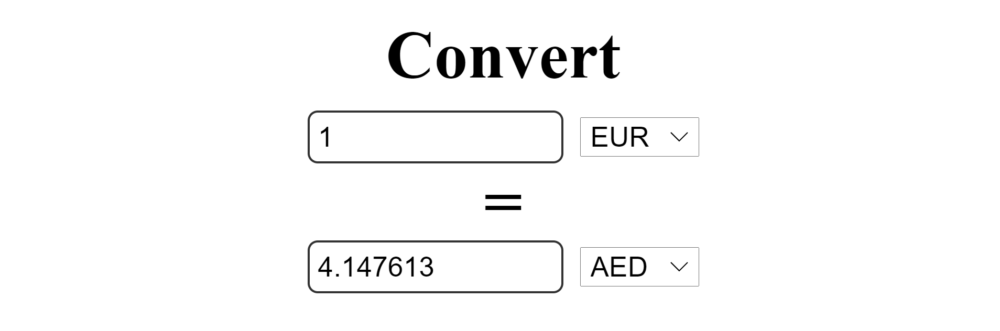

<h1 align="center"> React
 Currency Converter 👋</h1>

  <a href="#">
  
  <a href="#">
  
  <a href="#">
  
  <a href="#">
  
   
  <a href="https://www.buymeacoffee.com/adampham123">
  
  <a href="#">
  
  <a href="#">
  
  
  <a href="#">
  
  
  
  
  

## Description:
 Building a Currency Converter with REACT using hooks. This project will handle API calls, two way data binding, useEffect, useState, and much more so it is a great project for learning about all the basics of React.

## Table of Contents:
- [Description](#description)
- [Installation](#installation)
- [Usage](#usage)
- [Contributor](#contributor)
- [Contribution](#contribution)
- [Contact Information](#contact-information)

## Installation:
`npm install`

## Usage:

`npm start`

## Contributor:

## Contribution:
Please email to me if you have any contribution, I am more than happy with that. Thank you!

## Contact Information:

Github: [Thai Hoang(Adam), Pham](https://github.com/ThiHoangPham)

Email: thaihoangpham2008@gmail.com

<a href="#">↥ back to top</a>

- - -

© 2021 Thai Hoang(Adam), Pham: Currency Converter
